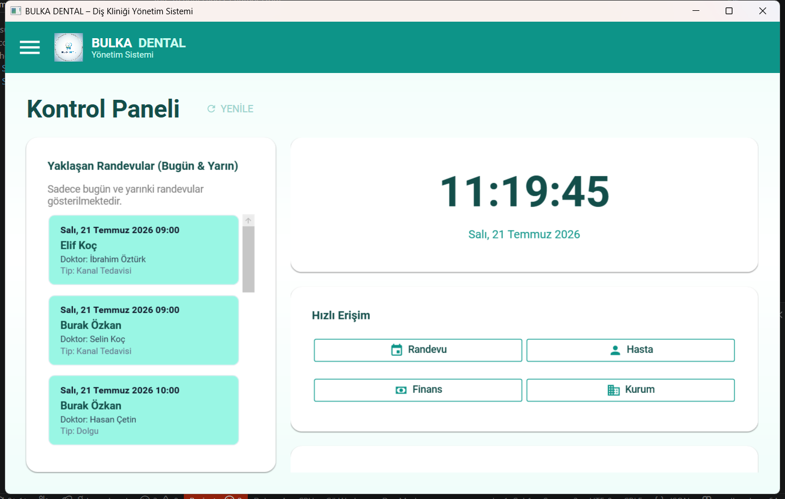
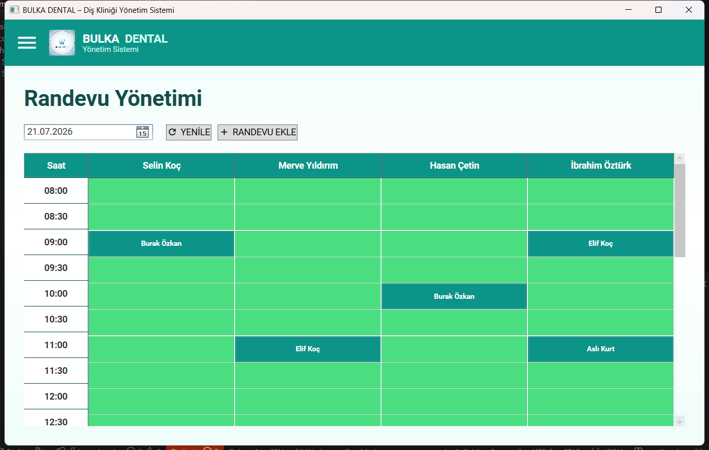
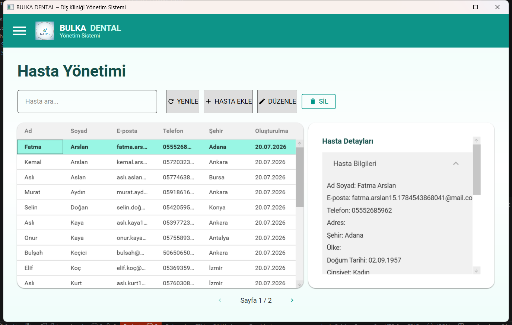
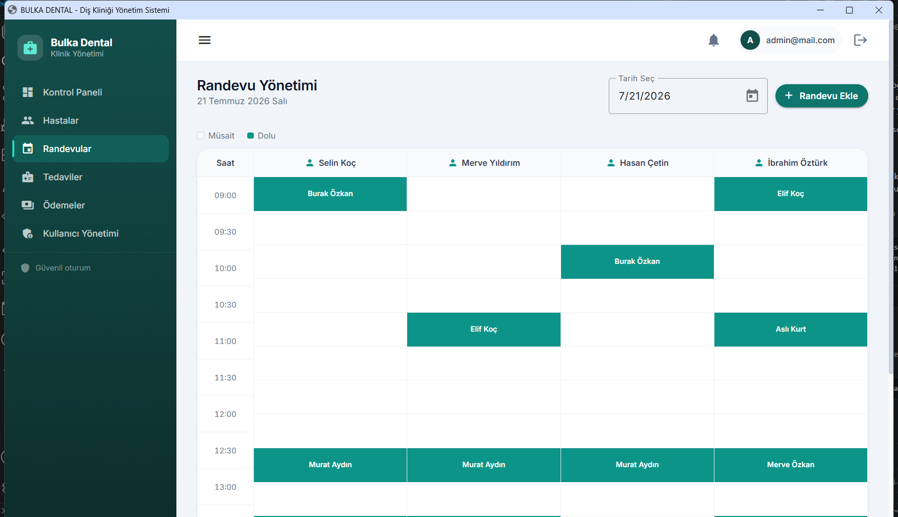
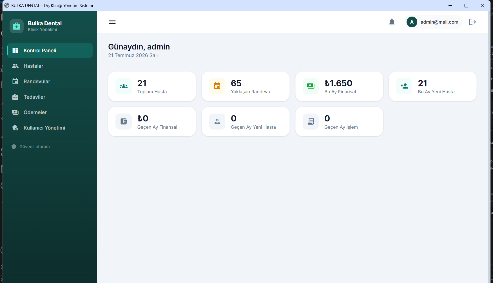

# 🦷 Bulka Dental — Diş Kliniği Yönetim Sistemi

**Node.js/Express/PostgreSQL** üzerinde çalışan, **Web (Angular)**, **Masaüstü (WPF)** ve
**Mobil (Flutter)** olmak üzere üç ayrı istemciyle aynı klinikte hasta, randevu, tedavi
ve ödeme süreçlerini tek yerden yöneten güvenli, gerçek zamanlı bir diş kliniği yönetim
sistemi.

Üç istemci de aynı REST API'yi ve aynı **"Aqua Mint"** tasarım dilini (turkuaz + nane +
mercan, yuvarlak köşeler) paylaşır — hangi platformdan girerseniz girin tutarlı bir
deneyim sunar.

---

## 📸 Ekran Görüntüleri

<table>
<tr>
<td width="50%">

**Masaüstü — Kontrol Paneli**


</td>
<td width="50%">

**Masaüstü — Randevu Yönetimi**


</td>
</tr>
<tr>
<td width="50%">

**Masaüstü — Hasta Yönetimi**


</td>
<td width="50%">

**Web — Randevu Takvimi**


</td>
</tr>
</table>

**Web — Kontrol Paneli**


---

## 🖥️ Platformlar

| Platform | Teknoloji | Konum |
|---|---|---|
| Backend API + Socket.IO | Node.js / Express / PostgreSQL | `src/`, `db/` |
| Web | Angular 18 + Material | `dental-app-web/` |
| Masaüstü | WPF (.NET 8) + MaterialDesignInXAML | `DentalApp.Desktop/` |
| Mobil | Flutter (Android/iOS) | `dental_app_mobile/` |

Gerçek zamanlı bildirimler tüm istemcilerde **Socket.IO** ile çalışır
(web: `socket.io-client`, masaüstü: `SocketIOClient` NuGet, mobil: `socket_io_client`).

> **Not — TDB tarifesi ve diş şeması:** `tdb_2026_tarife_full.json` ve
> `mouth_chart.png` üç istemcide de ayrı bundle edilir
> (`dental-app-web/src/assets/`, `DentalApp.Desktop/Data|Assets/`,
> `dental_app_mobile/assets/`). Tarife güncellemesinde ÜÇ kopya da
> güncellenmelidir.

## 🚀 Deployment

İnternet üzerinden dağıtım için: [deploy/DEPLOYMENT.md](deploy/DEPLOYMENT.md)
— ana yol Windows (Caddy + NSSM), alternatif olarak Ubuntu/Linux VPS
(nginx + PM2 + Certbot) adımları da dokümanda mevcut.

## ✨ Özellikler

### Güvenlik
- ✅ Refresh token'lı JWT kimlik doğrulama (15dk access, 7 gün refresh)
- ✅ Başarısız girişten sonra hesap kilitleme (5 deneme, 15dk kilit)
- ✅ Şifre güçlülük kontrolü ve şifre geçmişi takibi
- ✅ E-posta doğrulama ve şifre sıfırlama
- ✅ IP bazlı rate limiting
- ✅ Kapsamlı denetim (audit) günlüğü
- ✅ Rol bazlı erişim kontrolü (RBAC) — Patron / Sekreter / Diş Hekimi

### Kullanıcı Yönetimi
- ✅ Kullanıcı CRUD işlemleri
- ✅ Rol yönetimi (patron, sekreter, diş hekimi)
- ✅ Şifre değiştirme
- ✅ E-posta doğrulama akışı

### Klinik Özellikleri
- ✅ Hasta yönetimi (tıbbi geçmiş dahil CRUD)
- ✅ Çakışma kontrollü randevu planlama
- ✅ TDB tarifesine bağlı tedavi kayıtları ve diş şeması
- ✅ Kurum/sigorta anlaşmaları ve kategori bazlı indirim yönetimi
- ✅ Ödeme takibi, gelir/gider özeti, diş hekimi ciro/kazanç raporu
- ✅ Tüm kayıtlarda soft delete

## 🛠️ Kurulum

### Gereksinimler
- Node.js 18+
- Yerelde veya erişilebilir uzak bir PostgreSQL
- (Opsiyonel) E-posta doğrulama/şifre sıfırlama için SMTP sunucusu

### Ortam Değişkenleri

1. `.env.example` dosyasını `.env` olarak kopyalayın
2. Ayarları düzenleyin:

```env
# Server
PORT=3000
APP_URL=http://localhost:3000

# Database
DB_HOST=localhost
DB_PORT=5432
DB_NAME=dentalappdb
DB_USER=dentaluser
DB_PASS=StrongPass123!

# Security
JWT_SECRET=your-secret-key-change-in-production
MAX_FAILED_ATTEMPTS=5
LOCKOUT_DURATION_MINUTES=15

# Email (optional - set EMAIL_ENABLED=true to activate)
EMAIL_ENABLED=false
EMAIL_HOST=smtp.gmail.com
EMAIL_PORT=587
EMAIL_USER=your-email@gmail.com
EMAIL_PASS=your-app-password

# Admin User
ADMIN_EMAIL=admin@mail.com
ADMIN_PASSWORD=Admin@123456
```

### Kurulum ve Veritabanı

```bash
# Bağımlılıkları kur
npm install

# Veritabanı şemasını uygula
npm run db:migrate

# Patron/admin kullanıcı oluştur
npm run db:seed:admin
```

## 💻 Geliştirme

```bash
npm run dev
```

Web, masaüstü ve mobil istemcilerin kendi kurulum adımları için ilgili
klasörlerdeki README dosyalarına bakın: [`dental-app-web/README.md`](dental-app-web/README.md),
[`DentalApp.Desktop/README.md`](DentalApp.Desktop/README.md),
[`dental_app_mobile/README.md`](dental_app_mobile/README.md).

## 📦 Production

```bash
npm start
```

## 🔌 API Uç Noktaları

### Kimlik Doğrulama
- `POST /api/auth/login` - Giriş (access + refresh token döner)
- `POST /api/auth/refresh` - Access token yenileme
- `POST /api/auth/logout` - Çıkış (refresh token iptali)
- `POST /api/auth/request-reset` - Şifre sıfırlama e-postası iste
- `POST /api/auth/reset-password` - Token ile şifre sıfırla
- `GET /api/auth/verify-email/:token` - E-posta doğrula
- `POST /api/auth/resend-verification` - Doğrulama e-postasını yeniden gönder

### Kullanıcılar (çoğu işlem sadece admin)
- `GET /api/users` - Kullanıcıları listele (admin)
- `POST /api/users` - Kullanıcı oluştur (admin)
- `GET /api/users/:id` - Kullanıcı getir (kendisi veya admin)
- `PUT /api/users/:id` - Kullanıcı güncelle (kendisi veya admin)
- `DELETE /api/users/:id` - Kullanıcı sil (admin)
- `PUT /api/users/:id/password` - Şifre değiştir (kendisi)
- `PUT /api/users/:id/roles` - Rol güncelle (admin)

### Hastalar (kimliği doğrulanmış kullanıcılar)
- `GET /api/patients` - Hastaları listele
- `POST /api/patients` - Hasta oluştur
- `GET /api/patients/:id` - Hasta detayı
- `PUT /api/patients/:id` - Hasta güncelle
- `DELETE /api/patients/:id` - Hasta sil (admin)

### Randevular (kimliği doğrulanmış kullanıcılar)
- `GET /api/appointments` - Randevuları listele
- `POST /api/appointments` - Randevu oluştur
- `GET /api/appointments/:id` - Randevu detayı
- `PUT /api/appointments/:id` - Randevu güncelle
- `DELETE /api/appointments/:id` - Randevu iptal et

### Tedaviler (kimliği doğrulanmış kullanıcılar)
- `GET /api/treatments` - Tedavileri listele
- `POST /api/treatments` - Tedavi kaydı oluştur
- `GET /api/treatments/:id` - Tedavi detayı
- `PUT /api/treatments/:id` - Tedavi güncelle

### Sağlık & Admin
- `GET /healthz` - Sağlık kontrolü
- `GET /readyz` - Hazır olma kontrolü (DB dahil)
- `GET /admin/status` - Admin durumu (admin rolü gerekir)

## 🧪 Test

```bash
npm test
```

## 🔒 Güvenlik Özellikleri

### Hesap Kilitleme
- 5 başarısız girişten sonra hesap kilitlenir
- Kilit süresi: 15 dakika
- Süre dolunca otomatik açılır

### Şifre Politikası
- En az 8 karakter
- Büyük harf, küçük harf, rakam, özel karakter zorunlu
- Son 3 şifre tekrar kullanılamaz
- Yaygın şifreler engellenir

### Rate Limiting
- Genel: IP başına 15 dakikada 300 istek
- Auth uç noktaları: IP başına 15 dakikada 10 istek
- Şifre sıfırlama: IP başına saatte 3 istek
- E-posta doğrulama: IP başına saatte 5 istek

### Denetim Günlüğü
Tüm güvenlik olayları ve veri değişiklikleri loglanır:
- Giriş denemeleri (başarılı/başarısız)
- Şifre değişiklikleri ve sıfırlamaları
- Kullanıcı/hasta/randevu/tedavi değişiklikleri
- Admin işlemleri

## 🏗️ Mimari

```
src/
├── config/          # Yapılandırma yönetimi
├── controllers/     # İş mantığı
├── middlewares/     # Auth, güvenlik, rate limiting
├── routes/          # API route'ları
├── utils/           # Yardımcılar (logger, validator, e-posta)
└── db.js            # Veritabanı bağlantı havuzu
```

## 📄 Lisans

ISC
