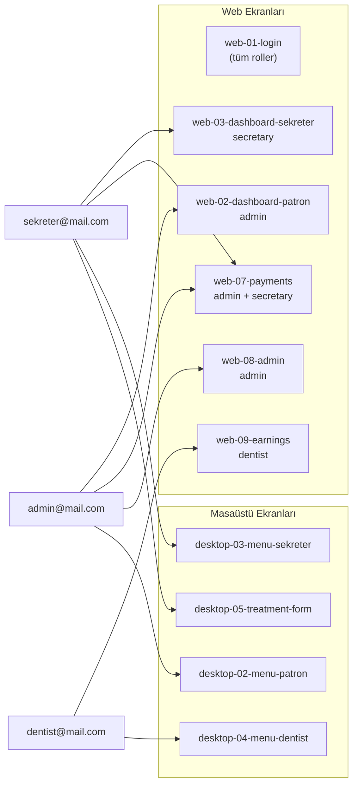

# BULKA DENTAL — MultiPlatformDentalApp Proje Dokümantasyonu

Bu doküman, **MultiPlatformDentalApp** projesinin ne yaptığını, hangi platformlarda çalıştığını, kimlerin hangi yetkilerle kullanabileceğini ve günlük klinik senaryolarını örneklerle açıklar.

> **Teslim durumu:** Proje ~%100 tamamlanmıştır. Güncel teslim raporu için [TESLIM.md](TESLIM.md), bu oturumda yapılan tüm işler için [CALISMA_OZETI.md](CALISMA_OZETI.md) dosyasına bakın.

---

## İçindekiler

1. [Proje Nedir?](#1-proje-nedir)
2. [Mimari Genel Bakış](#2-mimari-genel-bakış)
3. [Platformlar ve Teknolojiler](#3-platformlar-ve-teknolojiler)
4. [Kimler Kullanır? — Roller ve Kullanıcı Türleri](#4-kimler-kullanır--roller-ve-kullanıcı-türleri)
5. [Yetki Matrisi](#5-yetki-matrisi)
6. [Senaryo Örnekleri](#6-senaryo-örnekleri)
7. [Modüller ve Özellikler](#7-modüller-ve-özellikler)
8. [Kimlik Doğrulama ve Güvenlik](#8-kimlik-doğrulama-ve-güvenlik)
9. [Kurulum Rehberi (Detaylı)](#9-kurulum-rehberi-detaylı)
10. [Platform Karşılaştırması](#10-platform-karşılaştırması)
11. [Ekran Görüntüleri](#11-ekran-görüntüleri)
12. [Çalışma Özeti](#12-çalışma-özeti)

---

## 1. Proje Nedir?

**MultiPlatformDentalApp**, diş kliniklerinin günlük operasyonlarını dijitalleştiren çok platformlu bir **klinik yönetim sistemidir**. Sistem şu işleri kapsar:

- Hasta kayıtları ve tıbbi geçmiş
- Randevu planlama ve çakışma kontrolü
- Tedavi kayıtları (32 diş şeması ile)
- Ödeme, indirim ve kurum anlaşmaları
- Diş hekimi komisyon ve kazanç takibi
- Personel (kullanıcı) ve rol yönetimi
- Anlık bildirimler (Socket.IO / SignalR)

Tüm istemciler (web, masaüstü, mobil) **tek bir merkezi API** üzerinden çalışır. Veritabanı **PostgreSQL**'dir.

> **Önemli:** Bu sistemde **hasta girişi yoktur**. Hastalar veritabanındaki kayıtlardır; sisteme yalnızca klinik personeli (Patron, Sekreter, Diş Hekimi) giriş yapar.

---

## 2. Mimari Genel Bakış

```
┌─────────────────────────────────────────────────────────────────┐
│                        KULLANICI KATMANI                        │
├──────────────┬──────────────────┬───────────────────────────────┤
│  Web (Angular) │ Desktop (WPF)  │  Mobil (Flutter — geliştirme) │
│  Port: 4200    │  .NET 8        │  iOS / Android                │
└──────┬─────────┴────────┬───────┴──────────────┬────────────────┘
       │                  │                      │
       └──────────────────┼──────────────────────┘
                          │  HTTPS / REST + JWT
                          ▼
              ┌───────────────────────┐
              │   Backend API         │
              │   Node.js + Express   │
              │   Port: 3000          │
              │   Socket.IO Hub       │
              └───────────┬───────────┘
                          │
                          ▼
              ┌───────────────────────┐
              │   PostgreSQL          │
              │   dentalappdb         │
              └───────────────────────┘
```

**Yetkilendirme üç katmanda uygulanır:**

1. **API katmanı** — JWT doğrulama, rol kontrolü, diş hekimi için veri filtreleme
2. **Rota koruması** — Web'de `AuthGuard` ve `RoleGuard`
3. **Arayüz katmanı** — Menü gizleme, buton devre dışı bırakma, fiyat alanlarını maskeleme

---

## 3. Platformlar ve Teknolojiler

### 3.1 Backend API (`src/`)

| Özellik | Detay |
|---------|-------|
| **Teknoloji** | Node.js 18+, Express 5, PostgreSQL |
| **Kim kullanır?** | Doğrudan kullanıcı değil; tüm istemcilerin arka plan servisi |
| **Port** | Varsayılan `3000` |
| **Gerçek zamanlı** | Socket.IO bildirim merkezi |
| **Test** | Jest + Supertest (rol matrisi testleri dahil) |

Ana modüller: kimlik doğrulama, kullanıcılar, hastalar, randevular, tedaviler, ödemeler, kurum anlaşmaları, diş hekimi kazançları, yönetici istatistikleri.

### 3.2 Web Uygulaması (`dental-app-web/`)

| Özellik | Detay |
|---------|-------|
| **Teknoloji** | Angular 18, Angular Material, RxJS, SignalR |
| **Kim kullanır?** | Tarayıcıdan erişen tüm personel |
| **Port** | Varsayılan `4200` |
| **Durum** | Özellik açısından tam; klinik panelinin web sürümü |

**Erişim yolları (rotalar):**

| Rota | Kimler erişebilir? |
|------|-------------------|
| `/login` | Herkes (giriş öncesi) |
| `/dashboard` | Tüm giriş yapmış personel |
| `/patients` | Tüm personel (diş hekimi: salt okunur) |
| `/appointments` | Tüm personel (diş hekimi: yalnızca kendi randevuları) |
| `/treatments` | Tüm personel (diş hekimi: yalnızca kendi tedavileri, fiyat görmez) |
| `/payments` | **Patron + Sekreter** |
| `/admin` | **Yalnızca Patron** |
| `/earnings` | **Yalnızca Diş Hekimi** |

### 3.3 Masaüstü Uygulaması (`DentalApp.Desktop/`)

| Özellik | Detay |
|---------|-------|
| **Teknoloji** | .NET 8 WPF, MVVM, Material Design |
| **Kim kullanır?** | Windows bilgisayarda çalışan klinik personeli |
| **Durum** | En kapsamlı istemci; TDB 2026 tarife entegrasyonu mevcut |

Rol bazlı menü yapısı web'den biraz farklıdır — özellikle **Patron** menüsü daha dar tutulmuştur (Anasayfa, Kullanıcı Ekle, Finans). Sekreter ve diş hekimi menüleri günlük operasyonlara odaklıdır.

### 3.4 Mobil Uygulama (`dental_app_mobile/`)

| Özellik | Detay |
|---------|-------|
| **Teknoloji** | Flutter 3.x, Dart 3.x, Provider |
| **Hedef platform** | iOS ve Android |
| **Durum** | **Erken aşama** — yalnızca giriş ekranı ve ana sayfa iskeleti mevcut |
| **Kim kullanır?** | Gelecekte sahadaki personel (şu an üretim kullanımına hazır değil) |

README'de tanımlanan hasta listesi, randevu ekranları vb. henüz kodlanmamıştır.

---

## 4. Kimler Kullanır? — Roller ve Kullanıcı Türleri

Sistemde **üç personel rolü** vardır. Her kullanıcının tam olarak **bir rolü** bulunur.

| Rol kodu | Arayüzdeki ad | Kimdir? | Tipik kullanım |
|----------|---------------|---------|----------------|
| `admin` | **Patron** | Klinik sahibi / yönetici | Finansal kontrol, personel yönetimi, genel istatistikler |
| `secretary` | **Sekreter** | Ön büro / hasta kabul | Hasta kaydı, randevu, ödeme tahsilatı, kurum anlaşmaları |
| `dentist` | **Diş Hekimi** | Klinikte çalışan doktor | Kendi randevu ve tedavileri, kazanç takibi |

### Hasta ≠ Kullanıcı

Hastalar `patients` tablosundaki kayıtlardır. Örneğin **Ayşe Yılmaz** bir hasta kaydıdır; sisteme e-posta/şifre ile giriş yapmaz. Sekreter onu kaydeder, diş hekimi tedavisini yazar, patron veya sekreter ödemesini alır.

### Demo hesaplar

| E-posta | Şifre | Rol |
|---------|-------|-----|
| `admin@mail.com` | `Admin@123456` | Patron (`admin`) |
| `sekreter@mail.com` | `sekreter123456` | Sekreter (`secretary`) |
| `dentist@mail.com` | `dentist123456` | Diş Hekimi (`dentist`, %30 komisyon) |

---

## 5. Yetki Matrisi

Aşağıdaki tablo, her rolün neleri yapıp yapamayacağını özetler.

| Yetenek | Patron | Sekreter | Diş Hekimi |
|---------|:------:|:--------:|:------------:|
| Kontrol paneli (dashboard) | ✓ | ✓ | ✓ |
| Hasta listeleme | ✓ | ✓ | ✓ |
| Hasta ekleme / düzenleme | ✓ | ✓ | ✗ (salt okunur) |
| Hasta silme | ✓ | ✗ | ✗ |
| Tüm randevuları görme | ✓ | ✓ | ✗ (yalnızca kendi) |
| Randevu oluşturma / düzenleme | ✓ | ✓ | ✓ (kendi kapsamında) |
| Tüm tedavileri görme | ✓ | ✓ | ✗ (yalnızca kendi) |
| Tedavi kaydı oluşturma | ✓ | ✓ | ✓ |
| Tedavi fiyatlarını görme | ✓ | ✓ | ✗ |
| Ödeme / finans modülü | ✓ | ✓ | ✗ |
| Kurum anlaşmaları | ✓ | ✓ (silme: yalnızca patron) | ✗ |
| Kullanıcı oluşturma / rol değiştirme | ✓ | ✗ | ✗ |
| Diş hekimi listesini çekme | ✓ | ✓ (`?role=dentist` ile) | ✗ |
| Kendi kazançlarını görme | ✗ | ✗ | ✓ |
| Yönetici istatistikleri (`/api/admin`) | ✓ | ✗ | ✗ |

### API düzeyinde kritik kısıtlar

- **Diş hekimi randevu filtresi:** API, diş hekimi oturumunda `dentist_id = kullanıcı_id` koşulunu otomatik uygular.
- **Fiyat gizleme:** Tedavi maliyeti (`cost`) alanı diş hekimine `NULL` olarak döner; patron ve sekreter görür.
- **Ödeme uçları:** `/api/payments/*` yalnızca `admin` ve `secretary` rollerine açıktır.
- **Kullanıcı listesi:** Sekreter, `GET /api/users?role=dentist` ile yalnızca diş hekimi listesini alabilir; tüm kullanıcıları listelemeye çalışırsa `403 Forbidden` alır.

---

## 6. Senaryo Örnekleri

Aşağıdaki örnekler, aynı klinik gününde üç farklı personelin sistemi nasıl kullandığını gösterir.

---

### Senaryo A — Sekreter: Yeni hasta ve randevu

**Kullanıcı:** Zeynep (Sekreter) — `sekreter@mail.com`  
**Platform:** Web veya masaüstü

1. Zeynep sabah web uygulamasına giriş yapar.
2. **Hastalar** menüsünden yeni hasta **Mehmet Demir** kaydı oluşturur (TC, telefon, adres, tıbbi notlar).
3. **Randevular** ekranından Mehmet Demir için Dr. Can'a yarın saat 10:00 randevusu açar.
4. Sistem çakışma kontrolü yapar; aynı saatte başka randevu varsa uyarı verir.
5. Zeynep ödeme planı oluşturmak için **Ödemeler** modülüne gider — bu menü diş hekiminde görünmez.

**Zeynep yapamaz:**
- Dr. Can'ın komisyon oranını değiştirmek (kullanıcı yönetimi patrona özel)
- Hasta kaydını kalıcı silmek (yalnızca patron silebilir)

---

### Senaryo B — Diş Hekimi: Tedavi günü

**Kullanıcı:** Dr. Can (Diş Hekimi) — `dentist@mail.com`  
**Platform:** Masaüstü (tedavi formu ve diş şeması için tercih edilir)

1. Dr. Can giriş yaptığında yalnızca **kendine atanmış randevuları** görür; klinikteki diğer doktorların randevularını göremez.
2. **Hastalar** ekranında Mehmet Demir'in bilgilerini okuyabilir ancak telefon numarasını değiştiremez (salt okunur).
3. Tedavi sonrası **Tedavi** formunu açar, diş 16'ya dolgu işlemi kaydeder.
4. Tedavi formunda **ücret alanı görünmez** — fiyat bilgisi patron ve sekretere özeldir.
5. Ay sonunda **Kazançlarım** ekranından tamamlanan tedaviler üzerinden %30 komisyon hesabını ve maaş toplamını kontrol eder.

**Dr. Can yapamaz:**
- Finans / ödeme ekranına erişmek (menüde yok, API 403 döner)
- Başka bir diş hekiminin tedavi kayıtlarını görmek
- Yeni sekreter hesabı oluşturmak

---

### Senaryo C — Patron: Finans ve personel yönetimi

**Kullanıcı:** Ahmet Bey (Patron) — `admin@mail.com`  
**Platform:** Web veya masaüstü

1. Ahmet Bey **Kontrol Paneli**'nde aylık ciro, bekleyen ödemeler ve hasta sayısını inceler.
2. **Kullanıcı Yönetimi**'nden yeni bir sekreter hesabı oluşturur veya mevcut diş hekiminin komisyon oranını günceller.
3. **Ödemeler** modülünden Mehmet Demir'in tedavi planı için %10 indirim uygular ve nakit ödeme kaydeder.
4. Gerekirse kurum anlaşması (SGK, özel şirket vb.) tanımlar veya siler.
5. Hatalı veya mükerrer bir hasta kaydını kalıcı olarak siler.

**Ahmet Bey yapamaz:**
- Diş hekimi kazanç ekranını kullanmak (bu ekran yalnızca `dentist` rolüne açık; patron kendi kazancını değil, klinik finansını yönetir)

---

### Senaryo D — Aynı işlem, farklı platform tepkisi

**İşlem:** Diş hekimi `/payments` adresine gitmeye çalışıyor.

| Platform | Ne olur? |
|----------|----------|
| **Web** | `RoleGuard` devreye girer → kullanıcı `/dashboard`'a yönlendirilir |
| **Masaüstü** | Finans menü öğesi zaten görünmez |
| **API** | `GET /api/payments/pending-plans` → `403 Forbidden` |
| **Mobil** | Henüz ödeme ekranı yok; giriş sonrası yalnızca ana sayfa |

---

### Senaryo E — Sekreter, diş hekimi seçimi

Randevu formunda diş hekimi listesi gerektiğinde:

```
GET /api/users?role=dentist&limit=500
```

- **Sekreter** → `200 OK` (yalnızca diş hekimleri listelenir)
- **Sekreter, filtresiz** `GET /api/users` → `403 Forbidden`
- **Patron** → `200 OK` (tüm kullanıcılar)
- **Diş Hekimi** → `403 Forbidden`

Bu tasarım, sekreterin randevu ataması için gerekli minimum bilgiye erişmesini sağlarken tam personel listesini gizler.

---

## 7. Modüller ve Özellikler

### 7.1 Hasta Yönetimi
- CRUD işlemleri, arama, tıbbi geçmiş
- Yumuşak silme (soft delete)
- Diş hekimi: görüntüleme only

### 7.2 Randevu Yönetimi
- Tarih/saat planlama, durum takibi (bekliyor, tamamlandı, iptal vb.)
- Diş hekimi ve hasta eşleştirmesi
- Çakışma algılama

### 7.3 Tedavi Yönetimi
- Tedavi türü, tarih, notlar
- 32 dişlik diş şeması ve tedavi planı
- TDB 2026 tarife entegrasyonu (masaüstü)
- Rol bazlı fiyat görünürlüğü

### 7.4 Finans ve Ödemeler
- Tedavi planları, indirimler, tahsilat
- Borç / alacak takibi
- Kurum anlaşmaları (kategori bazlı indirimler)
- Diş hekimi komisyon hesabı (ödeme kayıtlarında)

### 7.5 Diş Hekimi Kazançları
- Tamamlanan tedaviler üzerinden ciro
- Komisyon oranı (`commission_rate`) ve maaş (`salary`)
- Tarih aralığına göre filtreleme

### 7.6 Bildirimler
- Socket.IO (backend) + SignalR istemcileri
- JWT ile kimlik doğrulamalı gerçek zamanlı bağlantı

### 7.7 Yönetim (Patron)
- Kullanıcı oluşturma: Patron, Sekreter, Diş Hekimi
- Rol düzenleme ve kullanıcı silme
- Sistem istatistikleri

---

## 8. Kimlik Doğrulama ve Güvenlik

### Giriş akışı

```
1. POST /api/auth/login  { email, password }
2. ← accessToken + refreshToken + user (roles dizisi ile)
3. Her istek: Authorization: Bearer <accessToken>
4. Token süresi dolunca: POST /api/auth/refresh
5. Çıkış: POST /api/auth/logout (refresh token iptal)
```

### Güvenlik özellikleri

| Özellik | Açıklama |
|---------|----------|
| JWT + refresh token | Access token kısa ömürlü; refresh token veritabanında saklanır |
| Hesap kilitleme | Başarısız giriş denemelerinden sonra geçici kilit |
| Şifre politikası | Güçlü şifre zorunluluğu ve geçmiş şifre kontrolü |
| Rate limiting | IP bazlı istek sınırlama |
| Audit log | Kritik işlemlerin kaydı |
| Helmet + CORS | HTTP güvenlik başlıkları ve kaynak kısıtlama |
| E-posta doğrulama | İsteğe bağlı hesap doğrulama ve şifre sıfırlama |

### İstemci tarafı koruma (Web)

- `AuthGuard` — token yoksa `/login`'e yönlendirir
- `RoleGuard` — rol uymuyorsa `/dashboard`'a yönlendirir
- `auth.interceptor` — Bearer token ekler; `401` alınca oturumu kapatır

---

## 9. Kurulum Rehberi (Detaylı)

Bu bölüm, projeyi sıfırdan çalışır hale getirmek için adım adım kurulum talimatlarını içerir. Sıra önemlidir: önce veritabanı ve backend, ardından istemciler.

### 9.1 Gereksinimler

| Bileşen | Minimum sürüm | Kontrol komutu |
|---------|---------------|----------------|
| Node.js | 18+ | `node -v` |
| npm | 9+ | `npm -v` |
| PostgreSQL | 14+ | `psql --version` |
| Angular CLI (web) | 18+ | `ng version` |
| .NET SDK (masaüstü) | 8.0+ | `dotnet --version` |
| Flutter (mobil) | 3.x | `flutter --version` |

**İşletim sistemi notları:**

- **Backend, Web, PostgreSQL:** Windows, macOS, Linux
- **Masaüstü (WPF):** Yalnızca Windows
- **Mobil (Flutter):** Windows/macOS (iOS derlemesi için macOS + Xcode gerekir)

### 9.2 Kurulum sırası (özet)

```
1. PostgreSQL kurulumu ve veritabanı oluşturma
2. .env dosyası yapılandırması
3. Backend bağımlılıkları + migration + seed
4. Backend'i başlatma (port 3000)
5. Web / Masaüstü / Mobil istemciyi ayrı ayrı başlatma
6. Demo hesaplarla giriş testi
```

---

### 9.3 Adım 1 — PostgreSQL kurulumu

#### Windows

1. [PostgreSQL indirme sayfasından](https://www.postgresql.org/download/windows/) installer'ı indirin.
2. Kurulum sırasında `postgres` süper kullanıcı şifresini belirleyin.
3. İsteğe bağlı: **pgAdmin 4** bileşenini de kurun (görsel yönetim için).
4. Alternatif rehber: `PGADMIN_KURULUM.md` ve `PGADMIN_VERITABANI_OLUSTURMA.md`

#### macOS

```bash
brew install postgresql@16
brew services start postgresql@16
```

#### Linux (Debian/Ubuntu)

```bash
sudo apt-get update
sudo apt-get install postgresql postgresql-contrib
sudo systemctl start postgresql
```

#### Veritabanı ve kullanıcı oluşturma

```bash
# PostgreSQL'e bağlan
psql -U postgres
```

```sql
CREATE DATABASE dentalappdb;
CREATE USER dentaluser WITH PASSWORD 'StrongPass123!';
GRANT ALL PRIVILEGES ON DATABASE dentalappdb TO dentaluser;
\q
```

> **pgAdmin kullanıyorsanız:** Sunucuya bağlanın → Databases → Create → Database: `dentalappdb`. Kullanıcı için Login/Group Roles → Create → `dentaluser`.

---

### 9.4 Adım 2 — Ortam değişkenleri (`.env`)

Proje kök dizininde `.env.example` dosyasını kopyalayın:

```bash
# Proje kök dizininde
cp .env.example .env        # macOS / Linux
copy .env.example .env      # Windows CMD
Copy-Item .env.example .env # Windows PowerShell
```

Minimum çalışır yapılandırma:

```env
# Sunucu
PORT=3000
NODE_ENV=development
APP_URL=http://localhost:3000

# Veritabanı
DB_HOST=localhost
DB_PORT=5432
DB_NAME=dentalappdb
DB_USER=dentaluser
DB_PASS=StrongPass123!
DB_SSL=false

# Güvenlik
JWT_SECRET=gelistirme-icin-guclu-bir-anahtar-degistirin
CORS_ORIGINS=http://localhost:3000,http://localhost:4200

# E-posta (geliştirmede kapalı tutulabilir)
EMAIL_ENABLED=false

# İlk patron hesabı (seed sırasında kullanılır)
ADMIN_EMAIL=admin@mail.com
ADMIN_PASSWORD=Admin@123456
```

| Değişken | Açıklama |
|----------|----------|
| `JWT_SECRET` | Üretimde mutlaka güçlü ve benzersiz bir değer kullanın |
| `CORS_ORIGINS` | Web (`4200`) ve API (`3000`) adreslerini virgülle ayırın |
| `EMAIL_ENABLED` | `false` ise e-posta doğrulama devre dışı kalır |

---

### 9.5 Adım 3 — Backend kurulumu

```bash
# Proje kök dizinine gidin
cd MultiPlatformDentalApp

# Bağımlılıkları yükleyin
npm install

# Veritabanı şemasını uygulayın
npm run db:migrate

# Patron (admin) hesabını oluşturun
npm run db:seed:admin

# Sekreter ve diş hekimi demo hesaplarını oluşturun
node scripts/seedUsers.js

# (Opsiyonel) 100 hasta, randevu ve ödeme içeren demo veri
npm run db:seed:demo
```

**Beklenen çıktı:** `db:migrate` sonrası tablolar oluşur; seed komutları kullanıcıları ekler (zaten varsa atlar).

#### Backend'i başlatma

```bash
# Geliştirme modu (otomatik yeniden başlatma)
npm run dev

# Üretim modu
npm start
```

#### Bağlantı testi

Tarayıcıda veya terminalde:

```bash
# Sağlık kontrolü
curl http://localhost:3000/healthz

# Veritabanı hazırlık kontrolü
curl http://localhost:3000/readyz
```

Başarılı yanıt örneği: `{"status":"ok"}` veya benzeri JSON.

#### Backend sorun giderme

| Hata | Olası neden | Çözüm |
|------|-------------|-------|
| `password authentication failed` | `.env` şifresi yanlış | `DB_USER` / `DB_PASS` değerlerini kontrol edin |
| `database "dentalappdb" does not exist` | DB oluşturulmamış | [9.3](#93-adım-1--postgresql-kurulumu) adımlarını uygulayın |
| `EADDRINUSE :::3000` | Port meşgul | Başka süreci kapatın veya `PORT` değiştirin |
| `relation already exists` | Migration tekrar çalıştırıldı | Normal; şema `IF NOT EXISTS` kullanır |

---

### 9.6 Adım 4 — Web uygulaması kurulumu

```bash
cd dental-app-web
npm install

# Geliştirme sunucusu
npm start
# veya
ng serve
```

Tarayıcıda açın: **http://localhost:4200**

#### API adresi yapılandırması

Geliştirme ortamı (`dental-app-web/src/environments/environment.ts`):

```typescript
export const environment = {
  production: false,
  apiUrl: 'http://localhost:3000',
  socketUrl: 'http://localhost:3000'
};
```

Üretim derlemesi için `environment.prod.ts` dosyasındaki `apiUrl` değerini gerçek sunucu adresine güncelleyin.

```bash
# Üretim build
ng build --configuration production
# Çıktı: dental-app-web/dist/
```

#### Web sorun giderme

| Hata | Çözüm |
|------|-------|
| `CORS error` | Backend `.env` içinde `CORS_ORIGINS` listesine `http://localhost:4200` ekleyin |
| `401 Unauthorized` | Backend çalışıyor mu kontrol edin; token süresi dolmuşsa yeniden giriş yapın |
| `ng: command not found` | `npm install -g @angular/cli` çalıştırın |

---

### 9.7 Adım 5 — Masaüstü (WPF) kurulumu

**Gereksinim:** Windows + .NET 8 SDK

```bash
cd DentalApp.Desktop
dotnet restore
dotnet build
dotnet run
```

Visual Studio 2022 ile: `MultiPlatformDentalApp.sln` dosyasını açın → `DentalApp.Desktop` projesini başlangıç projesi yapın → **F5**.

#### API adresi

`DentalApp.Desktop/Services/ApiService.cs`:

```csharp
public string BaseUrl { get; set; } = "http://localhost:3000/api";
```

Backend farklı bir makinede çalışıyorsa bu adresi güncelleyin.

#### Masaüstü sorun giderme

| Hata | Çözüm |
|------|-------|
| `NETSDK1045` | .NET 8 SDK yükleyin |
| Giriş başarısız | Backend'in `3000` portunda çalıştığını doğrulayın |
| SignalR bağlantı hatası | Firewall / antivirüs istisnası ekleyin |

---

### 9.8 Adım 6 — Mobil (Flutter) kurulumu

> Mobil istemci henüz geliştirme aşamasındadır; yalnızca giriş ve ana sayfa iskeleti mevcuttur.

```bash
cd dental_app_mobile
flutter pub get
flutter devices          # Bağlı cihaz/emülatör listesi
flutter run              # Varsayılan cihazda çalıştır
```

#### Android emülatör

Android Studio → Device Manager → sanal cihaz oluşturun → `flutter run`

#### API adresi (fiziksel cihaz için)

`dental_app_mobile/lib/services/api_service.dart` içinde `localhost` fiziksel telefonda çalışmaz. Bilgisayarınızın yerel IP adresini kullanın:

```dart
ApiService({this.baseUrl = 'http://192.168.1.100:3000'});
```

Ayrıca backend `.env` dosyasına mobil erişim için CORS veya ağ izni gerekebilir.

#### Derleme

```bash
flutter build apk          # Android APK
flutter build appbundle    # Play Store
flutter build ios          # iOS (yalnızca macOS)
```

---

### 9.9 Demo hesaplar ve ilk giriş testi

Seed işlemlerinden sonra aşağıdaki hesaplar kullanılabilir:

| E-posta | Şifre | Rol | Ne test edilir? |
|---------|-------|-----|-----------------|
| `admin@mail.com` | `Admin@123456` | Patron | Dashboard, Kullanıcı Yönetimi, Ödemeler |
| `sekreter@mail.com` | `sekreter123456` | Sekreter | Hasta, Randevu, Ödemeler |
| `dentist@mail.com` | `dentist123456` | Diş Hekimi | Kendi randevuları, Tedavi, Kazançlarım |

**Önerilen test akışı:**

1. `admin@mail.com` ile giriş → `/admin` ve `/payments` sayfalarına erişim doğrulanır.
2. Çıkış → `dentist@mail.com` ile giriş → `/payments` adresine gidildiğinde dashboard'a yönlendirme beklenir.
3. `sekreter@mail.com` ile giriş → yeni hasta ekleme ve randevu oluşturma denenir.

`npm run db:seed:demo` çalıştırıldıysa hasta, randevu ve ödeme listelerinde örnek veriler görünür.

---

### 9.10 Tüm servisleri birlikte çalıştırma

Geliştirme ortamında tipik terminal düzeni:

| Terminal | Komut | Adres |
|----------|-------|-------|
| 1 | `npm run dev` (kök dizin) | http://localhost:3000 |
| 2 | `npm start` (`dental-app-web/`) | http://localhost:4200 |
| 3 | `dotnet run` (`DentalApp.Desktop/`) | WPF penceresi |

PostgreSQL servisinin arka planda çalıştığından emin olun:

```bash
# Windows (PowerShell — servis adı kuruluma göre değişebilir)
Get-Service postgresql*

# macOS
brew services list

# Linux
sudo systemctl status postgresql
```

---

### 9.11 Testleri çalıştırma

Backend rol ve yetki testleri:

```bash
# Proje kök dizininde
npm test
```

Özellikle `tests/role-matrix.test.js` dosyası sekreter, diş hekimi ve patron erişim kurallarını doğrular.

---

### 9.12 İlgili dokümanlar

| Dosya | İçerik |
|-------|--------|
| `DB_SETUP.md` | Veritabanı kurulumu (Türkçe) |
| `PGADMIN_KURULUM.md` | pgAdmin kurulumu |
| `PGADMIN_VERITABANI_OLUSTURMA.md` | pgAdmin ile DB oluşturma |
| `.env.example` | Tüm ortam değişkenleri şablonu |
| `README.md` | Backend API özeti |

---

## 10. Platform Karşılaştırması

| Özellik | Web | Masaüstü (WPF) | Mobil (Flutter) |
|---------|:---:|:--------------:|:---------------:|
| Hasta yönetimi | ✓ | ✓ | — (planlı) |
| Randevu yönetimi | ✓ | ✓ | — (planlı) |
| Tedavi + diş şeması | ✓ | ✓ | — |
| TDB tarife entegrasyonu | Kısmi | ✓ (tam JSON) | — |
| Ödemeler / finans | ✓ | ✓ | — |
| Kurum anlaşmaları | ✓ | ✓ | — |
| Kullanıcı yönetimi | ✓ | ✓ | — |
| Diş hekimi kazançları | ✓ | ✓ | — |
| Rol bazlı menü | ✓ | ✓ | — |
| Gerçek zamanlı bildirim | SignalR | SignalR | SignalR (hazır) |
| Üretim hazırlığı | ✓ | ✓ | ✗ (iskelet) |

### Hangi platformu kim tercih etmeli?

| Personel | Önerilen platform | Gerekçe |
|----------|-------------------|---------|
| **Sekreter** | Web veya masaüstü | Hızlı hasta/randevu girişi; ödeme işlemleri her iki platformda da tam |
| **Diş Hekimi** | Masaüstü | Diş şeması ve tedavi formu masaüstünde daha zengin; kazanç takibi her iki platformda mevcut |
| **Patron** | Web | Kullanıcı yönetimi ve finansal özet için web yeterli; uzaktan erişim kolaylığı |
| **Saha / mobil ihtiyaç** | Mobil (gelecek) | Henüz kullanıma hazır değil |

---

## 11. Ekran Görüntüleri

Bu bölümde uygulamanın temel ekranları için **yer tutucular** bulunur. Görüntüleri `docs/assets/screenshots/` klasörüne ekledikçe aşağıdaki bağlantılar otomatik olarak çalışır.

> Tüm beklenen dosyaların listesi: [`docs/assets/screenshots/README.md`](assets/screenshots/README.md)

---

### 11.1 Web uygulaması

#### Giriş ekranı


| | |
|---|---|
| **Dosya** | `docs/assets/screenshots/web-01-login.png` |
| **Ne göstermeli?** | E-posta ve şifre alanları, "Giriş Yap" butonu, BULKA DENTAL markası |
| **Önerilen hesap** | Herhangi bir demo hesap (görüntü alınmadan önce form dolu olabilir) |
| **Durum** | ⏳ Ekran görüntüsü eklenecek |

---

#### Kontrol paneli — Patron


| | |
|---|---|
| **Dosya** | `docs/assets/screenshots/web-02-dashboard-patron.png` |
| **Ne göstermeli?** | Aylık ciro, hasta sayısı, bekleyen ödemeler; sol menüde tüm modüller |
| **Önerilen hesap** | `admin@mail.com` |
| **Durum** | ⏳ Ekran görüntüsü eklenecek |

---

#### Kontrol paneli — Sekreter


| | |
|---|---|
| **Dosya** | `docs/assets/screenshots/web-03-dashboard-sekreter.png` |
| **Ne göstermeli?** | Sekreter menüsü (Ödemeler görünür, Kullanıcı Yönetimi ve Kazançlarım görünmez) |
| **Önerilen hesap** | `sekreter@mail.com` |
| **Durum** | ⏳ Ekran görüntüsü eklenecek |

---

#### Hasta listesi


| | |
|---|---|
| **Dosya** | `docs/assets/screenshots/web-04-patients.png` |
| **Ne göstermeli?** | Hasta tablosu, arama çubuğu, "Yeni Hasta" butonu |
| **Önerilen hesap** | `sekreter@mail.com` |
| **Durum** | ⏳ Ekran görüntüsü eklenecek |

---

#### Randevular


| | |
|---|---|
| **Dosya** | `docs/assets/screenshots/web-05-appointments.png` |
| **Ne göstermeli?** | Randevu listesi, tarih filtresi, yeni randevu oluşturma |
| **Önerilen hesap** | `sekreter@mail.com` |
| **Durum** | ⏳ Ekran görüntüsü eklenecek |

---

#### Tedaviler


| | |
|---|---|
| **Dosya** | `docs/assets/screenshots/web-06-treatments.png` |
| **Ne göstermeli?** | Tedavi kayıtları; patron/sekreter için fiyat sütunu görünür |
| **Önerilen hesap** | `sekreter@mail.com` (fiyatlı görünüm) |
| **Durum** | ⏳ Ekran görüntüsü eklenecek |

---

#### Ödemeler


| | |
|---|---|
| **Dosya** | `docs/assets/screenshots/web-07-payments.png` |
| **Ne göstermeli?** | Bekleyen planlar, indirim uygulama, ödeme kaydı |
| **Önerilen hesap** | `admin@mail.com` veya `sekreter@mail.com` |
| **Durum** | ⏳ Ekran görüntüsü eklenecek |

---

#### Kullanıcı yönetimi (yalnızca Patron)


| | |
|---|---|
| **Dosya** | `docs/assets/screenshots/web-08-admin.png` |
| **Ne göstermeli?** | Kullanıcı tablosu, yeni kullanıcı formu, rol seçimi (Patron / Sekreter / Diş Hekimi) |
| **Önerilen hesap** | `admin@mail.com` |
| **Durum** | ⏳ Ekran görüntüsü eklenecek |

---

#### Diş hekimi kazançları


| | |
|---|---|
| **Dosya** | `docs/assets/screenshots/web-09-earnings.png` |
| **Ne göstermeli?** | Toplam ciro, komisyon oranı (%30), tamamlanan tedavi listesi |
| **Önerilen hesap** | `dentist@mail.com` |
| **Durum** | ⏳ Ekran görüntüsü eklenecek |

---

### 11.2 Masaüstü (WPF) uygulaması

#### Giriş penceresi


| | |
|---|---|
| **Dosya** | `docs/assets/screenshots/desktop-01-login.png` |
| **Ne göstermeli?** | Material Design giriş penceresi, e-posta/şifre alanları |
| **Durum** | ⏳ Ekran görüntüsü eklenecek |

---

#### Yan menü — Patron


| | |
|---|---|
| **Dosya** | `docs/assets/screenshots/desktop-02-menu-patron.png` |
| **Ne göstermeli?** | Dar patron menüsü: Anasayfa, Kullanıcı Ekle, Finans |
| **Önerilen hesap** | `admin@mail.com` |
| **Durum** | ⏳ Ekran görüntüsü eklenecek |

---

#### Yan menü — Sekreter


| | |
|---|---|
| **Dosya** | `docs/assets/screenshots/desktop-03-menu-sekreter.png` |
| **Ne göstermeli?** | Sekreter menüsü: Randevu, Hasta, Finans, Kurum Anlaşmaları, Protez, SMS |
| **Önerilen hesap** | `sekreter@mail.com` |
| **Durum** | ⏳ Ekran görüntüsü eklenecek |

---

#### Yan menü — Diş Hekimi


| | |
|---|---|
| **Dosya** | `docs/assets/screenshots/desktop-04-menu-dentist.png` |
| **Ne göstermeli?** | Diş hekimi menüsü: Anasayfa, Randevu, Hasta, Tedavi, Kazançlarım — **Finans yok** |
| **Önerilen hesap** | `dentist@mail.com` |
| **Durum** | ⏳ Ekran görüntüsü eklenecek |

---

#### Tedavi formu ve diş şeması


| | |
|---|---|
| **Dosya** | `docs/assets/screenshots/desktop-05-treatment-form.png` |
| **Ne göstermeli?** | Diş şeması, seçili dişler, tedavi türü; sekreter/patron için fiyat alanı |
| **Önerilen hesap** | `sekreter@mail.com` |
| **Durum** | ⏳ Ekran görüntüsü eklenecek |

---

### 11.3 Mobil (Flutter) uygulaması

#### Giriş ekranı


| | |
|---|---|
| **Dosya** | `docs/assets/screenshots/mobile-01-login.png` |
| **Ne göstermeli?** | Mobil giriş formu (erken aşama arayüz) |
| **Durum** | ⏳ Ekran görüntüsü eklenecek |

---

### 11.4 Backend API

#### Sağlık kontrolü


| | |
|---|---|
| **Dosya** | `docs/assets/screenshots/api-01-healthz.png` |
| **Ne göstermeli?** | Tarayıcıda `http://localhost:3000/healthz` veya Postman'de başarılı JSON yanıtı |
| **Durum** | ⏳ Ekran görüntüsü eklenecek |

---

### 11.5 Rol karşılaştırması (görsel özet)

Aşağıdaki diyagram, hangi ekran görüntüsünün hangi rolle alınması gerektiğini özetler:



---

## Özet

**MultiPlatformDentalApp**, tek API üzerinde çalışan, rol tabanlı yetkilendirmeli bir diş kliniği yönetim sistemidir:

- **3 personel rolü:** Patron, Sekreter, Diş Hekimi
- **Hastalar** sisteme giriş yapmaz; personel tarafından yönetilen kayıtlardır
- **Finansal veriler** (fiyat, ödeme, kurum anlaşması) patron ve sekretere özeldir
- **Diş hekimi** yalnızca kendi randevu/tedavi verisini görür; kendi kazancını takip eder
- **Web ve masaüstü** üretim kullanımına hazır; **mobil** geliştirme aşamasındadır

Yetki ve rol davranışının kaynak gerçeği (source of truth) için şu dosyalara bakılabilir:

- `src/middlewares/auth.js` — API yetki yardımcıları
- `dental-app-web/src/app/app.routes.ts` — web rota koruması
- `DentalApp.Desktop/MainWindow.xaml` — masaüstü rol menüleri
- `tests/role-matrix.test.js` — otomatik rol testleri

---

## 12. Çalışma Özeti

Bu oturumda yapılan tüm işler (dokümantasyon, backend, web, masaüstü, mobil, testler, Flutter kurulumu, emülatör denemesi) tek dosyada toplanmıştır:

**[docs/CALISMA_OZETI.md](CALISMA_OZETI.md)**

İçerik özeti:
- Oturum kronolojisi (6 aşama)
- Veritabanı, backend, web, masaüstü, mobil değişiklikleri
- Yeni dosyalar ve düzeltilen bug'lar
- Test sonuçları (17/17 backend, web build, dotnet build, flutter analyze/test)
- Demo hesaplar ve çalıştırma komutları
- Bilinen kısıtlar

---

*Son güncelleme: Haziran 2026 — proje kod tabanına göre hazırlanmıştır. Ekran görüntüleri `docs/assets/screenshots/` klasörüne eklendikçe [Bölüm 11](#11-ekran-görüntüleri) güncellenmelidir.*
